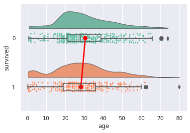
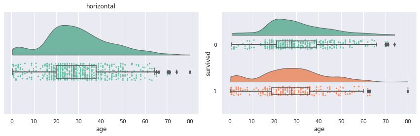
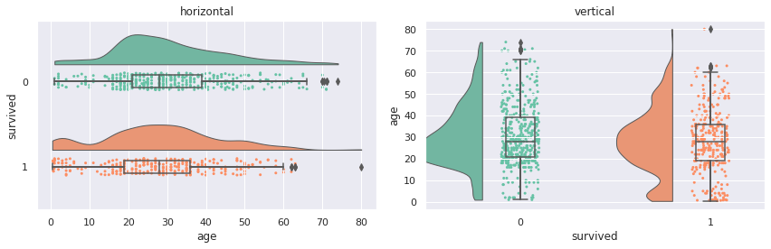
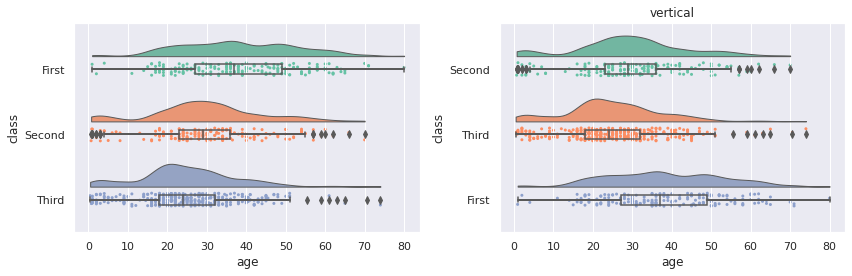
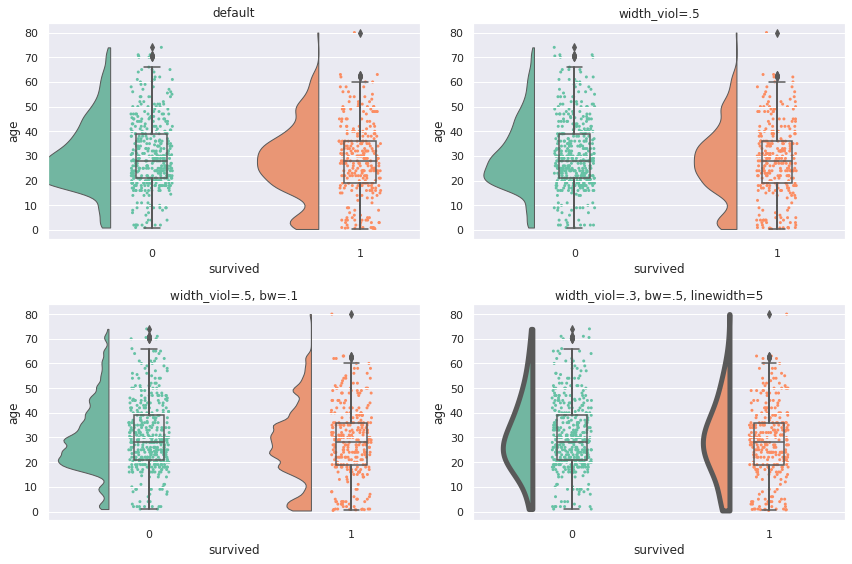
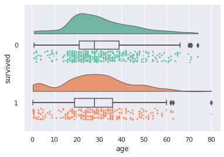
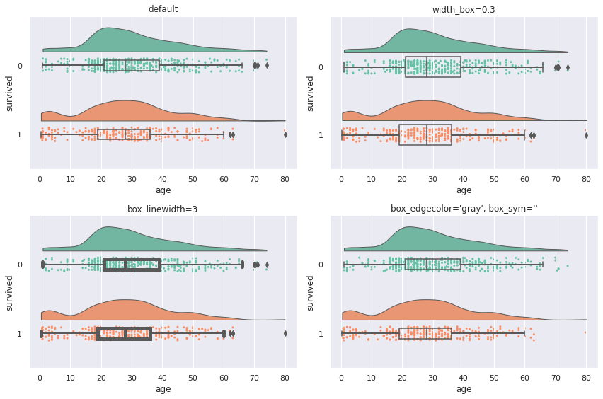
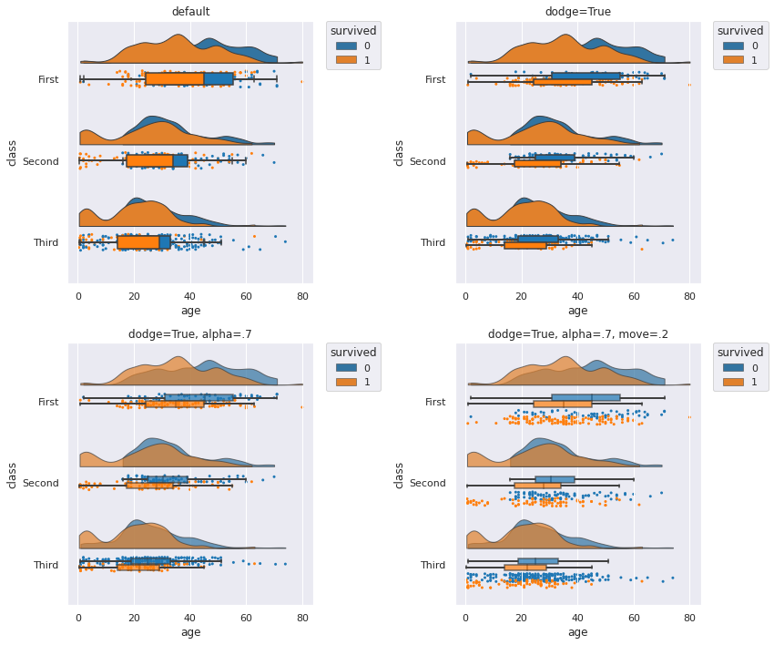
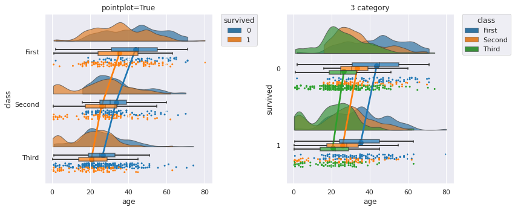
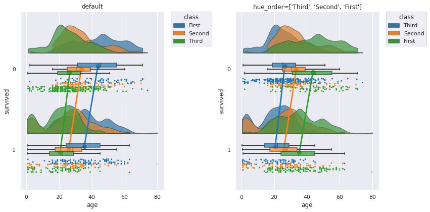

# study_raincloudplot_python

## Raincloud plotとは？

Raincloud plotとは、散布図、片側バイオリン図、箱ひげ図の3つのグラフにて構成されたグラフのことです。



それぞれのグラフの配置の様子から、各グラフを雲や雨、傘と表現します。
グループ間の平均値を結ぶ線を描くこともあり、これは雷と表現します。

- 片側バイオリン図(half violin plot)
  - Cloud
- 散布図(strip plot)
  - Rain
- 箱ひげ図(box plot)
  - Umberella
- グループ間の平均値を結ぶ線(point plot)
  - Thunder

## それぞれのグラフの特徴


### 箱ひげ図(box plot)

箱ひげ図は、中央値(第2四分位数)、第1四分位数、第3四分位数、最大値、最小値を記載したグラフです。
その他に平均や外れ値を記載することがあります。

箱ひげ図でもデータの主だった特徴を捉えることができますが、山がふたつ以上あるデータだとうまく捉えることができません。

### バイオリン図(violin plot)

バイオリン図は箱ひげ図にカーネル密度グラフを付加したグラフです。

バイオリンの形と表されるカーネル密度グラフにより、山が複数あるグラフでもどのような偏りがあるかを捉えることができます。
箱ひげ図が真ん中にあるので、箱ひげ図の情報よりも多くの情報を得られます。

ただし、カーネル密度により滑らかに描画するので、値がない箇所においても値があるかのように表示されてしまいます。
バンド幅の設定によって見え方も変わります。
また同じカーネル密度グラフが左右2つあるので、情報が余計です（個人的主観）。

### 散布図(strip plot)

散布図は、平均や中央値はわかりませんが、値のばらつき度合いが分かります。
特に外れ値や値のない谷間の箇所がどこかを知るのに役立ちます。

### Raincloud plot


箱ひげ図、バイオリン図、散布図、それぞれデータの特徴を捉えることができますが、それひとつだけでは捉えきれない特徴があります。


Raincloud plotでは、余計な片方のカーネル密度グラフを削除、箱ひげ図を離して見やすくしています。
また、散布図の付加で外れ値の情報も得られ、値がない谷間の箇所も分かります。

Raincloud plotは、それぞれのグラフの長所と短所をうまく混ぜて、ひとつにまとめたグラフです。
中央値(第2四分位数)、第1四分位数、第3四分位数、最大値、最小値、値のばらつき、まとまり具合、外れ値がわかり、多くの情報をひと目で知ることができるグラフになります。


## PythonでのRaincloud plot(ptitprinceの使い方)

PythonにおけるRaincloud plotの出力方法をご紹介します。

ライブラリは[pog87/PtitPrince](https://github.com/pog87/PtitPrince)を用います。


### インストール

まず、pipまたはcondaにてptitprinceをインストールします。

```python
pip install ptitprince
```

```python
conda install -c conda-forge ptitprince
```

あるいは、[pog87/PtitPrince](https://github.com/pog87/PtitPrince)より、`git clone`して下記を実行しインストールします。

```python
python setup.py install
```

### 準備

```python
import ptitprince as pt
import pandas as pd
import seaborn as sns
import matplotlib.pyplot as plt
```

データはタイタニックを使ってみます。

```python
titanic = sns.load_dataset('titanic')
```

ptitprinceは可視化ライブラリSeabornをベースにしていますので、Seabornでスタイルの調整などができます。

```python
sns.set()
```

### Raincloud plot 基本引数

- `data`
  - データセット
- `y`
- `x`

`data`にデータセットを指定し、`y`に変数を指定します。
二変数で並べて表示する場合は、`x`に別の変数を指定します。

```python
plt.figure(figsize=(12, 4))
plt.subplot(1,2,1)
plt.title("horizontal")
pt.RainCloud(data=titanic, y="age", orient="h")

plt.subplot(1,2,2)
pt.RainCloud(data=titanic, x="survived", y="age", orient="h")
plt.tight_layout()
```



平均値を結ぶ線、Thunderは、デフォルトでは表示されておらず、`pointplot=True`で表示されます。

```python
pt.RainCloud(data=titanic, x="survived", y="age", orient="h", pointplot=True)
```


### 向きの変更(orient)

- `orient="h"`
  - 水平
- `orient="v"`
  - 垂直(デフォルト)

グラフの向きは垂直がデフォルトになっています。

```python
plt.figure(figsize=(12, 4))
plt.subplot(1,2,1)
plt.title("horizontal")
pt.RainCloud(data=titanic, x="survived", y="age", orient="h")

plt.subplot(1,2,2)
plt.title("vertical")
pt.RainCloud(data=titanic, x="survived", y="age", orient="v")
plt.tight_layout()
```



### カラーパレットの変更(palette)

片側バイオリンと散布図に使われている色は、`palette`にて変更することができます。

カラーパレットは、Seabornにて使われているカラーパレットを利用できます。

- `palette`: カラーパレットの指定 (デフォルト: Set2)

```python
plt.figure(figsize=(12,8))
plt.subplot(2,2,1)
plt.title("Blues")
pt.RainCloud(data=titanic, x="class", y="age", orient="h", box_sym='', palette='Blues')

plt.subplot(2,2,2)
plt.title("tab10")
pt.RainCloud(data=titanic, x="class", y="age", orient="h", box_sym='', palette='tab10')

plt.subplot(2,2,3)
plt.title("Set1")
pt.RainCloud(data=titanic, x="class", y="age", orient="h", box_sym='', palette='Set1')

plt.subplot(2,2,4)
plt.title("colorblind")
pt.RainCloud(data=titanic, x="class", y="age", orient="h", box_sym='', palette='colorblind')
plt.tight_layout()
```


### x軸の表示順序の変更(order)

- `order`: xに設定したカテゴリ変数の順序を指定

`x`に指定した変数の順序を`order`にて変更することができます。

デフォルトで順序は値の昇順になります。

```python
plt.figure(figsize=(12, 4))
plt.subplot(1,2,1)
pt.RainCloud(data=titanic, x="class", y="age", orient="h")

plt.subplot(1,2,2)
plt.title("vertical")
pt.RainCloud(data=titanic, x="class", y="age", orient="h", order=['Second', 'Third', 'First'])
plt.tight_layout()
```



### Cloud(片側バイオリン)

Cloud、片側バイオリンの幅や位置などの調整方法です。

- `width_viol`: cloudの幅 (デフォルト=.7)
- `bw`: バンド幅 (デフォルト=.2)
- `linewidth`: cloudの線幅 (デフォルト=1)

```python
plt.figure(figsize=(12, 8))
plt.subplot(2,2,1)
plt.title("default")
pt.RainCloud(data=titanic, x="survived", y="age", orient="v")

plt.subplot(2,2,2)
plt.title("width_viol=.5")
pt.RainCloud(data=titanic, x="survived", y="age", orient="v", width_viol=.5)

plt.subplot(2,2,3)
plt.title("width_viol=.5, bw=.1")
pt.RainCloud(data=titanic, x="survived", y="age", orient="v", width_viol=.5, bw=.1)

plt.subplot(2,2,4)
plt.title("width_viol=.3, bw=.5, linewidth=5")
pt.RainCloud(data=titanic, x="survived", y="age", orient="v", width_viol=.3, bw=.5, linewidth=5)
plt.tight_layout()
```



デフォルトですと、バイオリンの高さが高すぎて飛び出たり重なったりすることもあるので、`width_viol`にて高さを調整します。

- `offset`: cloudの位置調整 (デフォルト: `max(width_box/1.8, .15) + .05`)

```python
plt.figure(figsize=(6, 4))
plt.subplot(1,2,1)
plt.title("default")
pt.RainCloud(data=sample, y="age", orient="v", width_viol=.3)

plt.subplot(1,2,2)
plt.title("offset=.12")
pt.RainCloud(data=sample, y="age", orient="v", width_viol=.3, offset=.12)
plt.tight_layout()
```


Cloudの位置が離れすぎていると感じたら、`offset`を指定することで、調整することができます。
少しの値でけっこうずれるので、ちょっと調整は大変ですが...


### Rain(散布図)

Rain、散布図の大きさや色などの調整方法です。

- `point_size`: 点の大きさ (デフォルト=3)
- `jitter`: 点のばらつき (デフォルト=1)
  - ばらつきを広くしたり、狭くしたりできます
- `rain_edgecolor`: 輪郭線の色
- `rain_linewidth`: 輪郭線の幅
- `rain_alpha`: 点の透過度


```python
plt.figure(figsize=(12, 8))
plt.subplot(2,2,1)
plt.title("default")
pt.RainCloud(data=titanic, x="survived", y="age", orient="h")

plt.subplot(2,2,2)
plt.title("point_size=2, jitter=2\nrain_alpha=.3")
pt.RainCloud(data=titanic, x="survived", y="age", orient="h", point_size=5, jitter=.02, rain_alpha=.3)

plt.subplot(2,2,3)
plt.title("point_size=10, jitter=.2\nrain_edgecolor='white', rain_linewidth=1, rain_alpha=.5")
pt.RainCloud(data=titanic, x="survived", y="age", orient="h", point_size=10, jitter=.2, rain_edgecolor='white', rain_linewidth=3, rain_alpha=.5)

plt.subplot(2,2,4)
plt.title(" point_size=5\nrain_edgecolor='gray', rain_linewidth=3, rain_alpha=.3")
pt.RainCloud(data=titanic, x="survived", y="age", orient="h", point_size=5, rain_edgecolor='gray', rain_linewidth=1, rain_alpha=.3)
plt.tight_layout()
```


`jitter`のばらつきは大きくしすぎると、Cloudと重なったりします。
ばらつきを小さくすれば、直線になっていきます。

ばらつきを小さくした場合は、点が重なりやすくなります。
`rain_alpha`で透過度を設定すると、色の濃い部分に値が多い箇所だと分かりやすくなります。

- `move`: rainの位置調整 (デフォルト: 0)

散布図はデフォルトで箱ひげ図と重なっていますが、移動して重ならないようにすることもできます。

```python
pt.RainCloud(data=titanic, x="survived", y="age", orient="h",  move=.2)
```



`jitter`(点のばらつき)や箱ひげ図の大きさがデフォルトのときは、`move=.2`あたりがギリギリ重ならなくなる値です。

(傘が雨の上にあるのはおかしいとか言ってはいけない)


### Umberella(箱ひげ図)

Umbrella、箱ひげ図の幅の調整方法です。

- `width_box`: 箱ひげ図の幅 (デフォルト: .15)
- `box_linewidth`: 箱ひげ図の線の幅 (デフォルト: 1)
- `box_sym`: 箱ひげ図の外れ値のマーカー

```python
plt.figure(figsize=(12,8))
plt.subplot(2,2,1)
plt.title("default")
pt.RainCloud(data=titanic, x="survived", y="age", orient="h")

plt.subplot(2,2,2)
plt.title("width_box=0.3")
pt.RainCloud(data=titanic, x="survived", y="age", orient="h", width_box=0.3)

plt.subplot(2,2,3)
plt.title("box_linewidth=3")
pt.RainCloud(data=titanic, x="survived", y="age", orient="h", box_linewidth=5)

plt.subplot(2,2,4)
plt.title("box_edgecolor='gray', box_sym=''")
pt.RainCloud(data=titanic, x="survived", y="age", orient="h", box_sym='')
plt.tight_layout()
```



箱ひげ図における外れ値はデフォルトで表示されていますが、散布図においても同じ値が表示されます。
同じ値が表示されていまうので、箱ひげ図の外れ値を表示したくない場合は、`box_sym=''`を指定することで非表示にできます。

なお、箱ひげ図は、後述するグラフの重ね(`hue`)をしない場合は塗りつぶしはありません。
また、箱ひげ図の線の色は黒色固定のため、残念ながら変更できません。


### Thunder(平均値)

`pointplot=True`にすることで、各グループの平均値を結ぶ線、Thunderを出力することができます。

- `pointplot`: 平均値を結ぶ線の表示有無 (デフォルト: false)
- `linecolor`: 線の色 (デフォルト: red)
- `point_linestyles`: 線のスタイル (デフォルト: -)
- `point_markers`: 平均値のマーカー (デフォルト: o)
- `point_scale`: 平均値のマーカーと線のスケール (デフォルト: 1)

```python
plt.figure(figsize=(12,12))
plt.subplot(3,2,1)
plt.title("default")
pt.RainCloud(data=titanic, x="class", y="age", orient="h", box_sym='', pointplot=True)

plt.subplot(3,2,2)
plt.title("linecolor='blue'")
pt.RainCloud(data=titanic, x="class", y="age", orient="h", box_sym='', pointplot=True, linecolor='blue')

plt.subplot(3,2,3)
plt.title("point_linestyles='--'")
pt.RainCloud(data=titanic, x="class", y="age", orient="h", box_sym='', pointplot=True, point_linestyles='--')

plt.subplot(3,2,4)
plt.title("point_linestyles=':'")
pt.RainCloud(data=titanic, x="class", y="age", orient="h", box_sym='', pointplot=True, point_linestyles=':')

plt.subplot(3,2,5)
plt.title("point_scale=0.7")
pt.RainCloud(data=titanic, x="class", y="age", orient="h", box_sym='', pointplot=True, point_scale=0.7)

plt.subplot(3,2,6)
plt.title("point_markers='*', point_scale=3")
pt.RainCloud(data=titanic, x="class", y="age", orient="h", box_sym='',pointplot=True, point_markers='*', point_scale=3)
plt.tight_layout()
```


### グラフを重ねる(hue)

`x`と`y`とは別に`hue`に変数を設定すると、その変数でグラフを重ねて表示することができます。

- `hue`: グラフを重ねたい変数を指定
- `dodge`: 重なった箱ひげ図をずらす (デフォルト: false)
- `alpha`: グラフの透明度 (デフォルト: None)
- `move`: rainの位置調整 (デフォルト: 0)

```python
plt.figure(figsize=(12,10))
plt.subplot(2,2,1)
plt.title("default")
pt.RainCloud(data=titanic, x="class", y="age", hue="survived", orient="h", box_sym='', palette='tab10')

plt.subplot(2,2,2)
plt.title("dodge=True")
pt.RainCloud(data=titanic, x="class", y="age", hue="survived", orient="h", box_sym='', palette='tab10', dodge=True)

plt.subplot(2,2,3)
plt.title("dodge=True, alpha=.7")
pt.RainCloud(data=titanic, x="class", y="age", hue="survived",  orient="h", box_sym='', palette='tab10', dodge=True, alpha=.7)

plt.subplot(2,2,4)
plt.title("dodge=True, alpha=.7, move=.2")
pt.RainCloud(data=titanic, x="class", y="age", hue="survived", orient="h", box_sym='', palette='tab10', dodge=True, alpha=.7, move=.2)
plt.tight_layout()
```



`hue`のみを利用した状態ですと、箱ひげ図が塗りつぶされ、重なった状態で、後ろに隠れたグラフが見えない状態です。
また、`hue`のカテゴリ数が多いとき、散布図と箱ひげ図が重なっていると非常に見にくくなります。

`hue`を利用したときは、`dodge`、`alpha`、`move`を設定したほうが見やすくなるかと思います。

グラフを重ねたときも、`pointplot=True`にて、平均値の線を結ぶことができます。

```python
plt.figure(figsize=(12,5))
plt.subplot(1,2,1)
plt.title("pointplot=True")
pt.RainCloud(data=titanic, x="class", y="age", hue="survived", orient="h", box_sym='', palette='tab10', dodge=True, alpha=.7, pointplot=True, move = .2)

plt.subplot(1,2,2)
plt.title("3 category")
pt.RainCloud(data=titanic, x="survived", y="age", hue="class", orient="h", box_sym='', palette='tab10', dodge=True, alpha=.7, pointplot=True, move = .2)
plt.tight_layout()
```



`hue`を設定したとき、平均値を結ぶ線の色は自動でカラーパレットの色になります。
このとき、`linecolor`で色を設定しても変更できません（色によっては見づらい...)。

- `hue_order`: `hue`に設定したカテゴリ変数の重なり順を指定

```python
plt.figure(figsize=(12,6))
plt.subplot(1,2,1)
plt.title("default")
pt.RainCloud(data=titanic, x="survived", y="age", hue="class", orient="h", box_sym='', palette='tab10', dodge=True, alpha=.7, pointplot=True, move=.2)

plt.subplot(1,2,2)
plt.title("hue_order=['Third', 'Second', 'First']")
pt.RainCloud(data=titanic, x="survived", y="age", hue="class", orient="h", box_sym='', palette='tab10', dodge=True, alpha=.7, pointplot=True, move=.2, hue_order=['Third', 'Second', 'First'])
plt.tight_layout()
```



`x`の順序を`order`で変更するように、重なった片側バイオリン図は`hue_order`で順序を変更することができます。

カラーパレットや`hue`に指定した変数のカテゴリ数にもよりますが、重なると分かりづらくなるので、重なる順序を指定して、見やすく指定できます。

カテゴリ数が大きいとさすがに順序だけでは見やすさの改善は難しいです。
この場合は、利用を諦めたほうが無難かと思います。

```python
pt.RainCloud(data=titanic, x="survived", y="age", hue="deck", orient="h", box_sym='', palette='tab10', dodge=True, alpha=.7, pointplot=True, move=.2)
```


## Cloud(片側バイオリン)以外を自前でRaincloud plotを作ってみる

[pog87/PtitPrince](https://github.com/pog87/PtitPrince)ですと、微妙に調整できない箇所があるので、片側バイオリン以外を自前でRaincloud plotをする方法もご紹介します。

片側バイオリンはSeabornでは出力できないので、ここだけは[pog87/PtitPrince](https://github.com/pog87/PtitPrince)の力を借ります。`half_violinplot`にて片側バイオリンを表示できます。

```python
pt.half_violinplot(data=titanic, x="survived", y="age", width=0.5, inner=None)
```


以下、散布図と箱ひげ図をSeabornで重ねた例です。

```python
plt.figure(figsize=(8, 4))
palette = 'Set2'
plt.subplot(1,2,1)
sns.stripplot(data=titanic, x="survived", y="age", zorder=0, palette=palette, size=2)
sns.boxplot(data=titanic, x="survived", y="age",  boxprops={'facecolor':'none', "zorder":1}, whiskerprops={'linewidth':2, "zorder":1}, width=.15)
pt.half_violinplot(data=titanic, x="survived", y="age", inner=None, palette=palette, width=0.4, offset=.15)

plt.subplot(1,2,2)
sns.swarmplot(data=titanic, x="survived", y="age",  zorder=0, palette=palette, size=2)
sns.boxplot(data=titanic, x="survived", y="age", boxprops={'facecolor':'none', "zorder":1}, whiskerprops={'linewidth':2, "zorder":1}, width=.15)
pt.half_violinplot(data=titanic, x="survived", y="age", inner=None, palette=palette, width=0.4, offset=.25)
plt.tight_layout()
```


散布図は、strip plotとswarm plotの二例を載せています。

strip plotは谷間は分かりやすいものの、山の部分がどのようになっているかが分かりにくいです。

swarm plotは点を積み重ねてくれるので、山の部分がどうなっているか分かりやすくなります。
Cloudは滑らかな山になるので、具体的な凹凸を知るときに役立ちます。

自前での作成の難点は、グラフのサイズや点のサイズを変更すると、片側バイオリン図と散布図がすぐ重なってしまうので、`offset`や`width`でうまく調整してあげる必要があるのが難点です。

point plotを使うことで、平均値を結ぶ線、Thunderも付加できます。

```python
plt.title("+Thunder")
palette = 'Set2'
sns.swarmplot(data=titanic, x="survived", y="age",  zorder=0, palette=palette, size=2)
sns.boxplot(data=titanic, x="survived", y="age", boxprops={'facecolor':'none', "zorder":1}, whiskerprops={'linewidth':2, "zorder":1}, width=.15)
sns.pointplot(data=titanic, x="survived", y="age",  zorder=2, errwidth=0, color='red')
pt.half_violinplot(data=titanic, x="survived", y="age", inner=None, palette=palette, cut=0, width=0.4, offset=.18)
```


## Python以外によるRaincloud plot

本記事はPythonによるRaincloud plotのご紹介でしたが、Python以外でもRaincloud plotを出力することができます。

### RによるRaincloud plot

- [jorvlan/raincloudplots](https://github.com/jorvlan/raincloudplots)を利用
- [wilkelab/ggridges](https://github.com/wilkelab/ggridges)を利用
  - [geom_density_ridges関数の説明](https://cran.r-project.org/web/packages/ggridges/vignettes/introduction.html#jittering-points)
- ggdistを利用
  - [ggdist: Make a Raincloud Plot to Visualize Distribution in ggplot2](https://www.r-bloggers.com/2021/07/ggdist-make-a-raincloud-plot-to-visualize-distribution-in-ggplot2/) (英語)
  - [Raincloud plotの描き方：ggplot2](https://kirikuroda.com/post/2021/10/22/raincloudplot-ggplot2/)
    - それぞれ、散布図の出力が異なり、前者は棒グラフのように点が積み上がっており、後者は点が散らばるような出力をしています。
- [gabrifc/raincloud-shiny](https://github.com/gabrifc/raincloud-shiny)を利用
  - ShinyにてRaincloud plotを出力


### SASによるRaincloud plot

- イーピーエス株式会社の森岡裕さんがSASユーザー総会2022にて発表したGTL(Graph Template Language)とSgrenderプロシジャを用いてRaincloud plotを実装した例
  - [SASによるRaincloud Plotの実装 | SASユーザー総会2022](https://www.sas.com/ja_jp/events/22/users-group-2022/sessions.html#m=a-1)
- SAS用グラフパッケージ「[SAS Plotter](https://github.com/Superman-jp/SAS_Plotter)のマクロを利用
  - [SAS PlotterでRaincloud plotを作図する | SupermanJP](https://superman-jp.hatenablog.com/entry/SASPlotter_Raincloud)
- SASパッケージフレームワーク「[SAS package](https://github.com/yabwon/SAS_PACKAGES)」のマクロを利用
  - [SAS package macro %RainCloudPlot()](https://github.com/yabwon/SAS_PACKAGES/blob/main/packages/baseplus.md#raincloudplot-macro)


## 参考

- [PtitPrinceによるPythonでのRaincloud plotの描画 | 大阪大学医学部 Python会 (情報医科学研究会)](https://oumpy.github.io/blog/2020/12/ptitprince_tutorial.html)
- [pog87/PtitPrince](https://github.com/pog87/PtitPrince)

